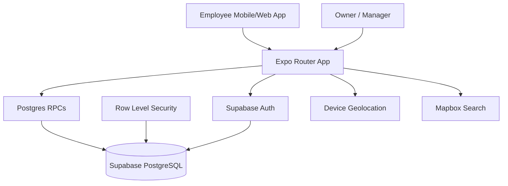
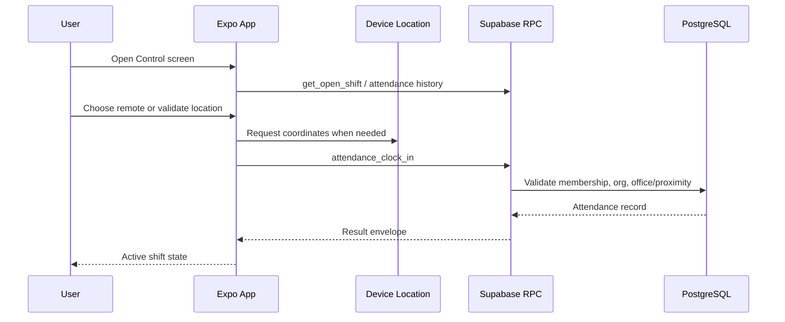

# ARCHITECTURE.md

> **Status**: Draft  
> **Last updated**: 2026-05-19  
> **System**: Minuto attendance app

## System Overview

Minuto is a mobile-first attendance tracking system for small businesses. The Expo application handles authentication, organization context, team management, clock-in/out, location/remote attendance validation, and attendance history. Supabase provides Auth, PostgreSQL storage, RLS policies, and RPC contracts that enforce organization and role boundaries.

## Architecture Pattern

**Chosen pattern**: Modular client + Supabase RPC backend.

**Why this pattern**: The product is small enough for a single Expo codebase and a single Supabase project, but complex enough to need clear module boundaries around auth, organizations, attendance, team management, and design primitives. Supabase RPCs centralize privileged mutations and reduce direct table-write exposure from the client.

**Alternatives evaluated**:

- **Custom REST backend**: not chosen because Supabase already provides auth, database, RLS, and server-side functions for the current scale.
- **Direct table CRUD from the client**: not chosen for sensitive mutations because attendance and team operations need role-aware server-side authorization.
- **Microservices**: not justified for a PyME-focused MVP with one product surface and one primary data store.

## Architecture Views & Diagrams

### System Context

### Attendance Flow

## Component Details

### Expo Application

- **Technology**: Expo SDK 55, React Native 0.83, React 19, Expo Router, TypeScript.
- **Responsibility**: UI, navigation, client-side validation, Supabase calls, local session handling.
- **Dependencies**: Supabase JS client, Expo Location, Mapbox search, theme primitives.
- **Failure modes**: missing env vars block Supabase initialization; network failures should show recoverable error states.

### Theme and UI System

- **Technology**: `src/theme` tokens and primitives with StyleSheet-based React Native styles.
- **Responsibility**: shared colors, typography, spacing, radius, surfaces, buttons, cards, fields, text, screen layout.
- **Dependencies**: platform font loading and `ThemeProvider`.
- **Failure modes**: duplicated inline styles and missing primitives create inconsistent UI/UX.

### Supabase RPC Layer

- **Technology**: PostgreSQL functions, RLS, Supabase Auth.
- **Responsibility**: privileged operations for attendance, organizations, membership invitations, team management, and employee profile updates.
- **Dependencies**: `auth.uid()`, membership tables, RLS policies, PostGIS in `extensions` schema.
- **Failure modes**: `SECURITY DEFINER` search path drift, ambiguous `RETURNS TABLE` variables, local/remote schema mismatch.

### PostgreSQL Data Store

- **Technology**: Supabase PostgreSQL 17 with RLS.
- **Responsibility**: source of truth for organizations, memberships, employee profiles, offices, attendance records, and invitations.
- **Dependencies**: migration history, remote project link, local Supabase Docker stack.
- **Failure modes**: local Supabase not running, missing seed data, drift between local migrations and remote state.

## Data Architecture

| Entity                 | Purpose                                                      |
| ---------------------- | ------------------------------------------------------------ |
| `user_profiles`        | User-owned profile data linked to `auth.users`               |
| `organizations`        | Company/workspace boundary                                   |
| `memberships`          | Role and status of a user/invitee in an organization         |
| `employee_profiles`    | Operational employee details per membership                  |
| `organization_offices` | Physical/remote office definitions for attendance validation |
| `attendance_records`   | Clock-in/out records, work date, office, auto-close state    |

The canonical schema source of truth is `supabase/migrations/`. Schema work must read the migration history first, and corrective migrations must not edit pushed migration files.

## API Architecture

- **Style**: Supabase RPC + selected read operations, not public REST endpoints.
- **Consumers**: Expo mobile/web app.
- **Authentication**: Supabase JWT/session.
- **Authorization**: organization membership roles enforced by RLS and RPC authorization checks.
- **Error handling**: client wrappers should normalize Supabase errors and validate RPC responses with Zod.
- **Versioning**: migration-based database contract evolution; corrective migrations instead of editing pushed migrations.
- **Pagination**: attendance history uses paged/grouped RPCs.
- **Rate limiting**: Supabase Auth configuration; product-specific abuse controls are future work.

## Non-Functional Requirements

### Performance

- Control screen interactive after navigation: <2s p95 on a mid-range device.
- Clock-in/out RPC round trip: <1s p95 under normal network conditions.
- Attendance history page query: <500ms p95 for a single member/month.

### Scalability

- Initial target: PyME organizations up to 100 employees.
- Data model should tolerate 10k attendance records per organization without UI or query redesign.
- Future scale trigger: add reporting/materialized views if history/report queries exceed 500ms p95.

### Availability and Reliability

- Target availability: 99.9% for production business hours.
- RPO/RTO: inherit Supabase managed backup baseline; document exact targets before production launch.
- Critical flows must degrade with clear retry/error states when Supabase or location services fail.

### Security

- Auth: Supabase Auth with short-lived JWT/session handling.
- Authorization: RBAC via memberships (`owner`, `admin`, `manager`, `employee`).
- Data: profile, membership, attendance, and location data are confidential business data.
- Required hardening: `SECURITY DEFINER` functions use `SET search_path = ''` and fully qualified references.
- Client must never expose service-role keys.

### Observability and Maintainability

- CI must run lint, typecheck, unit tests, and eventually Playwright E2E.
- Supabase advisors should be run during schema hardening.
- Large files over ~400 lines should be decomposed into reviewable modules.

## Key Decisions

| Decision                         | Rationale                                                          | Alternatives Considered     |
| -------------------------------- | ------------------------------------------------------------------ | --------------------------- |
| Expo Router app                  | One codebase for iOS, Android, and web                             | Separate native apps        |
| Supabase RPCs for mutations      | Centralizes role-aware authorization and business rules            | Direct client table writes  |
| PostgreSQL + RLS                 | Strong relational model for organizations, memberships, attendance | NoSQL or local-only storage |
| Web-first Playwright E2E         | Fast CI-compatible critical-path coverage                          | Native Android E2E first    |
| Design primitives in `src/theme` | Existing token/primitives foundation is good and should be reused  | Ad-hoc screen styling       |

## Failure Modes & Mitigations

| Failure                    | Impact                                   | Mitigation                                                |
| -------------------------- | ---------------------------------------- | --------------------------------------------------------- |
| Supabase unavailable       | Auth, attendance, team screens fail      | User-facing retry/error states; no silent writes          |
| Location permission denied | Physical office clock-in blocked         | Remote work path where allowed; explicit guidance         |
| Local/remote schema drift  | Migrations fail or RPC contracts diverge | `supabase migration list`, advisors, seed, contract tests |
| Ambiguous SQL references   | Runtime RPC failures                     | Fully qualify columns in `RETURNS TABLE` functions        |
| Missing design primitives  | UI inconsistency and duplicate code      | `DESIGN.md` plus primitive extraction plan           |

## Scaling Strategy

### Current

Single Expo app and one Supabase project are appropriate for MVP and early PyME use.

### Next Triggers

- Add reporting/materialized views when worked-hour reports become slow.
- Add dedicated observability once production users rely on daily attendance.
- Consider Edge Functions only if workflows outgrow SQL RPCs or require external integrations.

## ADRs

None required for this draft because it documents the existing architecture rather than changing it. Future architecture changes should create ADRs under `adr/` at the repository root.
